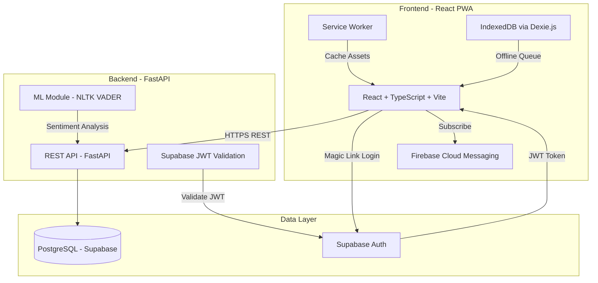

# Architecture Documentation

## System Architecture

dont-worry uses a clean three-layer architecture:

```
Frontend (React PWA) → Backend API (FastAPI) → Database (PostgreSQL)
```

Machine learning runs inside the backend as an internal module, not a separate microservice.



## Authentication Flow

1. User enters email on login page
2. Frontend requests a magic link from Supabase Auth
3. User clicks the magic link received via email
4. Supabase Auth returns a JWT + refresh token
5. Frontend includes JWT in all API requests (`Authorization: Bearer <token>`)
6. Backend validates the JWT against Supabase's JWT secret
7. Backend extracts `user_id` from the JWT `sub` claim -- never from client input

## Offline Sync

The app uses Dexie.js (IndexedDB wrapper) for offline storage:

1. When online: data is sent to the API and stored locally
2. When offline: data is stored locally with `synced: false`
3. When connection restores: the sync service pushes all unsynced items via `POST /api/sync`
4. After successful sync: local items are marked as `synced: true`
5. Conflict resolution: last-write-wins based on `created_at` timestamp

## Caching Strategy

| Resource Type | Strategy | Rationale |
|---|---|---|
| Static assets (JS, CSS, images) | Cache-first | Rarely change, fast load |
| API responses | Network-first | Data freshness matters |
| HTML shell | Cache-first with network update | App shell loads instantly |

## ML Module

The ML module contains three components:

1. **Sentiment Analyzer** (`ml/sentiment/analyzer.py`): Uses NLTK VADER to classify journal text as positive/neutral/negative
2. **Trend Detector** (`ml/trend/detector.py`): Uses scikit-learn linear regression on the last 14 days of mood data to detect improving/stable/declining trends
3. **Recommendation Engine** (`ml/recommendations/engine.py`): Rule-based system that matches mood patterns and sentiment to recommendation tags

## Database Schema

```mermaid
erDiagram
    users {
        uuid id PK
        varchar email
        timestamp created_at
        varchar role
    }
    moods {
        serial id PK
        uuid user_id FK
        integer value
        text note
        timestamp created_at
    }
    journal_entries {
        serial id PK
        uuid user_id FK
        text content
        varchar sentiment
        timestamp created_at
    }
    recommendations {
        serial id PK
        varchar title
        text description
        text_array tags
    }
    user_preferences {
        uuid user_id PK_FK
        varchar theme
        boolean notifications_enabled
        boolean show_onboarding
        timestamp created_at
        timestamp updated_at
    }

    users ||--o{ moods : "records"
    users ||--o{ journal_entries : "writes"
    users ||--o| user_preferences : "has"
```
